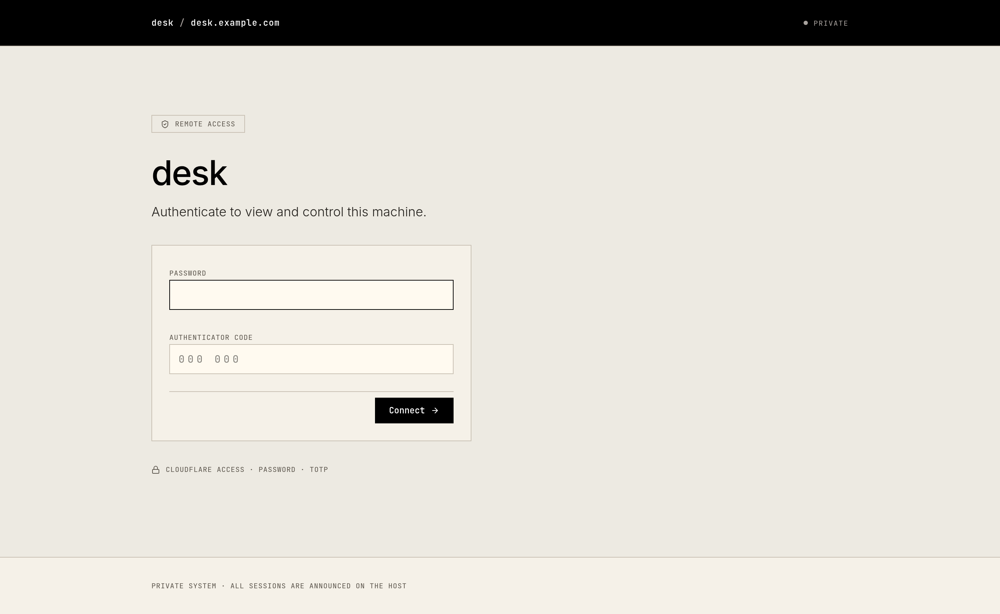

# desk

Low-latency remote desktop for your Linux PC, **in any browser**. Like Parsec, but self-hosted:
your PC streams its screen over WebRTC to a web page on your own domain, and you control it with
mouse and keyboard. No client to install and no inbound ports to open. It runs on free Cloudflare
services.

<p align="center"></p>

- **1080p60 H.264**: hardware encoding on NVIDIA (NVENC) and AMD/Intel (VA-API), with software x264 as a fallback
- **Low latency**: WebRTC peer-to-peer over UDP, playout delay turned off, adaptive bitrate from 2 to 20 Mbps
- **Full control**: mouse, wheel, keyboard (by physical key, so your PC's layout applies), and system shortcuts in fullscreen
- **Desktop audio**, **clipboard** in both directions, **monitor switching**, and a live latency/fps/bitrate readout
- **Works on strict networks**: falls back to Cloudflare's TURN relay (UDP or TLS on 443)
- **Three layers of login**: Cloudflare Access (email code), then a password (argon2id), then an authenticator-app code (TOTP)

## How it works

```
 Browser (laptop, anywhere)            Cloudflare                     Your PC
┌────────────────────────┐   HTTPS   ┌─────────────────┐  Tunnel   ┌──────────────────────────┐
│ login → viewer         │──────────▶│ Access (email   │──────────▶│ desk-agent (Rust)        │
│ <video> + input        │           │ one-time code)  │ outbound  │  127.0.0.1:8750          │
│                        │           └─────────────────┘   only    │  portal → PipeWire →     │
│                        │◀══ WebRTC: video, audio, input ══════════▶│  H.264 encoder           │
└────────────────────────┘    direct UDP, or via Cloudflare TURN    │  input → /dev/uinput     │
                                                                    └──────────────────────────┘
```

- **The agent** is a single Rust binary. It serves the web client, does the login, and handles
  WebRTC signaling on `127.0.0.1` only.
- **Cloudflare Tunnel** makes it reachable at your hostname through an *outbound* connection, so you
  don't need port forwarding or a public IP.
- **Cloudflare Access** blocks everyone at Cloudflare's edge except your email address. The agent
  checks Access's signed token on every request as well.
- **Media** goes directly between browser and PC whenever possible. When a network blocks that,
  it's relayed through Cloudflare TURN.

## Requirements

| | |
|---|---|
| **Host OS** | Linux with **Hyprland** (Wayland). Other compositors are not supported yet; PRs welcome. |
| **Packages** | Rust 1.85+ ([rustup](https://rustup.rs)), a C toolchain + `pkg-config` + `cmake`, Node.js 18+, GStreamer (base, good, bad, PipeWire), PipeWire, `xdg-desktop-portal-hyprland`, `wl-clipboard`, `libnotify`, `cloudflared`, `curl` |
| **Encoder** | NVIDIA: nothing extra. AMD/Intel: `gst-plugin-va` + a VA-API driver. No GPU: `gst-plugins-ugly` (x264). |
| **Cloudflare** | A free account with a domain (zone) on Cloudflare, and Zero Trust on the free plan |
| **Browser** | Recent Chrome, Edge, Brave or Firefox on the device you connect from (fullscreen key capture needs a Chromium-based browser) |

## Setup

```bash
git clone https://github.com/itsF4LCON/desk.git
cd desk
./scripts/setup.sh
```

The helper walks you through everything and can be re-run safely:

1. **Checks dependencies** and prints install commands for anything missing.
2. **Grants `/dev/uinput` access** (asks for sudo once), so the agent can inject mouse and keyboard.
3. **Builds** the agent and the web client.
4. **Sets up the headless monitor picker.** Hyprland normally asks you to click a monitor for every screen share. desk answers that dialog for its *own* requests only, and every other app still gets the normal picker.
5. **Creates a Cloudflare Tunnel** for your hostname. This one is separate from any tunnels you already have.
6. **Guides you through the Access application** in the dashboard (about 2 minutes). Then it creates the DNS record and **checks that Access is protecting the hostname** before anything is started. It reads the team domain and AUD tag automatically.
7. **Optionally takes a TURN key** for strict networks.
8. **Creates your login**: a password, plus a QR code for your authenticator app.
9. **Installs and starts** the `desk-agent` and `desk-tunnel` systemd user services, and adds a hook so Hyprland starts the agent at every login.

Then open `https://your-hostname`, enter your email and the code Cloudflare sends you, then your
password and authenticator code.

### Manual setup

If you'd rather do it by hand, read `scripts/setup.sh`. It is plain bash and every step is
commented. The config file format is documented in [`agent/config.example.toml`](agent/config.example.toml).

> [!NOTE]
> desk streams your **logged-in** Hyprland session. After a reboot, nothing can be shown until
> someone logs in, so if you want access after reboots, enable autologin in your display manager
> (or greetd) and lock the screen with your usual locker.

## Using it

- **Control:** click the video to give it keyboard focus.
- **Fullscreen** (toolbar) also captures system shortcuts like Alt+Tab and Super. This works in Chromium-based browsers.
- **Monitors:** switch with the buttons in the top bar.
- **Clipboard buttons** send this device's clipboard to the PC, or copy the PC's clipboard to this device.
- **Stats:** the top bar shows round-trip time, fps, bitrate, and whether you're `direct` or on `relay`.
- **Notifications:** every session start and end shows a notification on the PC itself.
- **Force the relay:** add `?relay=1` to the URL. This is useful for troubleshooting.

## Commands

```bash
desk-agent doctor                 # check encoder, capture, input, portal, config
desk-agent setup                  # change password / create a new authenticator secret
systemctl --user status desk-agent desk-tunnel
journalctl --user -u desk-agent -f
```

(`desk-agent` lives in `agent/target/release/`.)

## Security model

- **Nothing listens publicly.** The agent binds to `127.0.0.1`, and the only way in is the Cloudflare Tunnel.
- **Gate 1, Cloudflare Access:** only the configured email gets through Cloudflare's edge. The agent independently verifies the Access JWT (signature against the team's JWKS, `aud`, `iss`, expiry and email) and fails closed.
- **Gate 2, password:** hashed with argon2id.
- **Gate 3, TOTP:** RFC 6238 with ±30 s skew, and an accepted code can't be reused.
- **Lockout:** 5 failed logins lock logins for 15 minutes.
- **Sessions** are server-side, sent in a `__Host-` cookie that is `HttpOnly`, `Secure`, `SameSite=Strict`, and expire after 12 h. Every POST and the WebSocket require an exact `Origin` match.
- **Content Security Policy** is strict and allows no third-party resources: fonts and icons are self-hosted.
- **One viewer at a time.** A new login replaces the old session.
- **Stuck keys:** held keys are released when the tab loses focus, when the viewer disappears (1 s heartbeat), or when the connection drops.
- **Secrets** (password hash, TOTP secret, screen-share tokens) are stored in `~/.local/share/desk/state` with mode 0600.

> [!WARNING]
> Anyone who gets past these gates has full control of your PC. Use a strong, unique password and
> keep the Access policy limited to your own email.

## Costs

On typical personal use it's free:

- **Cloudflare Tunnel and Zero Trust Access:** free.
- **TURN relay:** the first 1,000 GB per month is free, then $0.05/GB. It is only used when a direct connection isn't possible. As a rough guide, desktop use is about 1–4 GB per hour and fast motion up to about 9 GB per hour.

## Troubleshooting

| Symptom | Fix |
|---|---|
| "Connection failed — network may block UDP" | Add a TURN key (re-run `setup.sh`, or add a `[turn]` section to the config), then try `?relay=1`. |
| Video works, mouse/keyboard don't | Run `desk-agent doctor`. `/dev/uinput` must be writable, so re-run `setup.sh` or log out and back in after installing the udev rule. |
| A screen-share picker pops up on the PC | Check that `~/.config/hypr/xdph.conf` points `custom_picker_binary` at `~/.local/bin/desk-picker`, then run `systemctl --user restart xdg-desktop-portal-hyprland`. |
| `no usable H.264 encoder found` | Install an encoder plugin (see Requirements). `doctor` lists what it tried. |
| Login page says "Access verification failed" | The `aud`/`team_domain` in the config don't match your Access application. Re-run `setup.sh`. |

## Status

Built and used daily on Arch Linux + Hyprland + NVIDIA, tested with Chrome and Firefox.
**The VA-API and x264 encoder paths are implemented but not yet tested on real AMD/Intel hardware,
and `setup.sh` has not yet been run on a fresh non-Arch install.** Reports and fixes are welcome.

Roadmap: gaming mode (pointer lock, relative mouse, gamepads), file transfer, touch input, and
more compositors (GNOME/KDE through the RemoteDesktop portal).

## Development

```bash
cd agent && cargo test                     # unit tests (auth, input mapping, STUN, …)
cd web && npm ci && npm run build          # builds web/dist
desk-agent serve --insecure-local          # local testing at http://localhost:8750 without Cloudflare
```

## License

[MIT](LICENSE)
